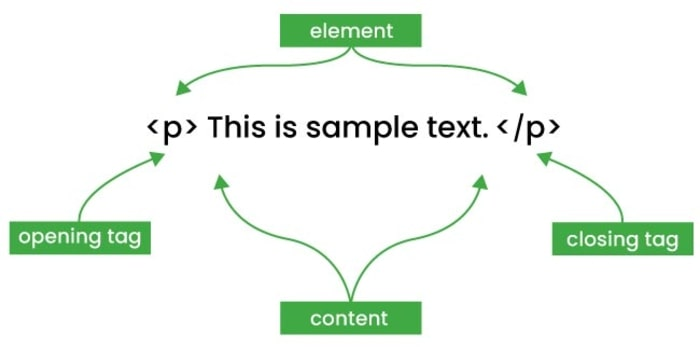
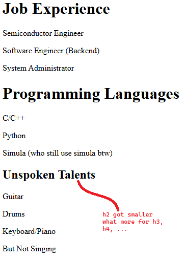

# HTML Basics

In this project, we are going to display and experiment HTML documents.
HTML or HyperText Markup Language is consist of a series of elements that act as a building
blocks of a web page. The following are the core components of a HTML document: <br> <br>
    &emsp;1. __Tag__ - keywords that are enclosed in angle brackets (e.g., `<title>`, `<h1>`, `<p>`); <br>
    &emsp;2. __Elements__ - consist of the tags and the content; <br>
    &emsp; <br>
    &emsp;&emsp;&emsp;_Reference_: _https://www.tutorialspoint.com/html/html_elements.htm_ <br>
    &emsp;3. __Attributes__ - placed inside the opening tag to provide extra information or settings for an element (e.g., `<a href="url">` or ``)

## Simple HTML Page

Start with a simple HTML. We are going to create a web page for passionate engineers.
This page will be entitled as "Engineer's Page" denoted by the \<title\> tags.

```
<!DOCTYPE html>
<html>
<head>
    <title>Engineer's Page</title>
</head>
<body>
    <h1>Hello, Engineer!</h1>
    <p>STATUS: Learning HTML.</p>
</body>
</html>
```


You can just create a simple HTML page by just using `<html>`-`<head>`-`<body>` format.
We will focus more on the `<body>` tag of a HTML document since it display what we want to see in the browser.
Multiple headings (denoted by h1, h2, ...) and paragraphs (denoted by p) can be used in a HTML.
By using an incrementing heading tags, the fonts get smaller and smallet to emphasize h1 as the first header.

```
<body>

    <h1>Job Experience</h1>
    <p>Semiconductor Engineer</p>
    <p>Software Engineer (Backend)</p>
    <p>System Administrator</p>

    <h1>Programming Languages</h1>
    <p>C/C++</p>
    <p>Python</p>
    <p>Simula (who still use simula btw)</p>

    <h2>Unspoken Talents</h2>
    <p>Guitar</p>
    <p>Drums</p>
    <p>Keyboard/Piano</p>
    <p>But Not Singing</p>

</body>
```



You can add _div_ for sections and the same results are going to be observed. <br>

```
<body>
    <div>
        <h1>Head 1</h1>
        <p>h1_p1</p>
        <p>h1_p2</p>
        <p>h2_p3</p>
    </div>

    <div>
        <h1>Head 2</h1>
        <p>h2_p1</p>
        <p>h2_p2</p>
        <p>h2_p3</p>
    </div>

    <div>
        <h2>Head 3</h2>
        <p>h3_p1</p>
        <p>h3_p2</p>
        <p>h3_p3</p>
    </div>
</body>
```

_div_ can be intimidating without trying to understand what it does, right?
Come to think of it as a division or a block of the display. For example, let's try to create something usable this time.
A web page with some partitions for the following:
    1. header block;
    2. subheader block;
