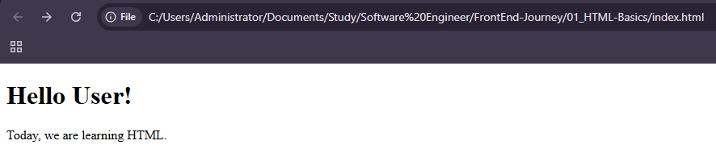

# HTML Basics

Start with a simple HTML. Open this file to display it in your browser <br>

```
<!DOCTYPE html>
<html>
<head>
    <title>My First Page</title>
</head>
<body>
    <h1>Hello User!</h1>
    <p>Today, we are learning HTML.</p>
</body>
</html>
```



